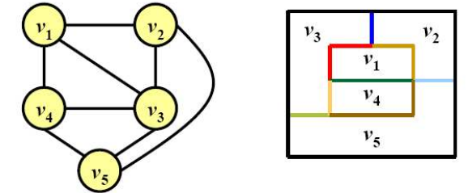
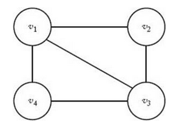
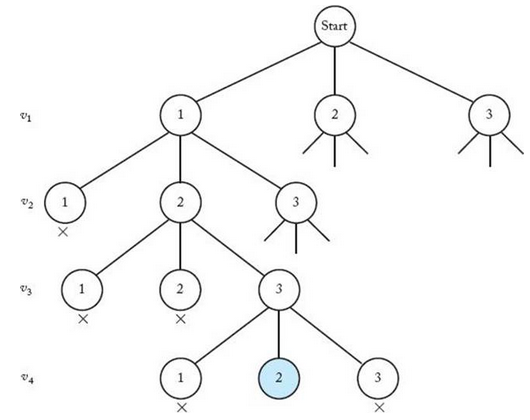

+++
title = "Graph_coloring"
description = ""
date = 2023-06-07
toc = true

[taxonomies]
categories = ["Backtracking"]
tags = ["algorithm", "Backtracking"]

[extra]
math=true
+++

---

# m-Coloring Problem
- `undirected graph` 상에서 최대 $m$ 개의 색을 이용해, <txtylw>*인접한 두 노드는 같은 색을 같지 않도록*</txtylw> 색칠하는 문제입니다.

---

# Planar Graph
- 지도 상의 각 `지역`은 하나의 `노드`로 표현할 수 있습니다.
- 그리고 서로 인접한 두 `지역`은 `edge` 로 연결되어 있는 모습으로 표현할 수 있습니다.
- 모든 지도는 두 `edge` 가 서로 교차하지 않는 <txtylw>***Planar Graph***</txtylw> 형태로 변환하여 그릴 수 있다고 합니다.



---

# Example


- 위와 같이 $4$개의 노드로 이루어진 그래프가 있다고 가정해봅니다.
- 만약 사용가능한 색상의 수가 $4$개 라면 자명한 답이 존재합니다.
  - 각 노드를 서로 다른 색으로 칠하면 됩니다...
- 따라서 노드의 수가 $n$개, 사용 가능한 색상의 수가 $m$개일 때 $m < n$ 인 경우를 생각해보면 됩니다.

---
- $m=2$ 일 때는 해답이 없습니다.
  - $v_1, v_2$ 를 서로 다른 색으로 칠하면 $v_1, v_3$ 가 서로 같은 색을 갖게 됩니다.
- $m=3$ 일 때는 해답이 존재합니다.
  - $v_1, v_2, v_3$ 를 서로 다른 색으로 칠하고 $v_2, v_4$ 가 같은 색을 가지면 됩니다.
  - 세 가지 색상을 각각 $c_1, c_2, c_3$ 라 할 때, 위 조건에 부합하는 조합을 나열하면 해답이 됩니다.

---

# Pruned State Space Tree


- <txtylw>***m-Coloring Problem***</txtylw> 을 Backtracking 으로 풀기 위해 <txtylw>state space tree</txtylw> 를 그리는 방법은 위 그림과 같습니다.
- 각 ***Level*** 은 노드(지도 상의 <u>지역</u>)를 의미합니다.
- 각 노드들은 색상($c_1, c_2, \dots, c_k$)을 의미합니다.
- 각 노드의 *Promising* 여부는 <u><txtylw>*인접한 두 노드가 서로 같은 색을 갖게 되는지*</txtylw></u> 를 체크하면 됩니다.

---

# Algorithm
- 따라서 알고리즘을 작성하면 아래와 같습니다.
```cpp
void m_coloring(index i) {
  int color;
  // Promising 여부 체크
  if (promising(i)) { 
    // 마지막 노드이므로 Solution 임
    if (i == n) { 
      for (int i = 0; i < n; i++)
        cout << colors[i] << ' ';
    } else { 
      // 아직 색칠할 노드가 남아있음
      for (color = 1; color <= m; color++) {
        // 다음 노드에 대해 일단 색을 칠하고 Backtracking 함
        colors[i + 1] = color;
        m_coloring(i + 1);
      }
    }
  }
}

bool promising(index i) {
  index j;
  bool switch = true;

  j = 1;
  // 현재 index 이전까지, 이미 색칠된 노드들에 대해 검사함
  while (j < i && switch) {
    // 만약 두 노드가 `인접`해있고, 같은 색을 가진다면 non-promising 임
    if (w[i][j] && colors[i] == colors[j])
      switch = false;
    j++;
  }

  return switch;
}
```

---

# Analysis
- <txtred>*Worst Time*</txtred> 으로 생각해보면, 각 지역마다 최대 $m$개의 색상을 선택할 수 있기 때문에 아래의 수식으로 표현할 수 있습니다.

$$O(n) = 1 + m + m^2 + \cdots + m^n = \frac{m^{n+1} - 1}{m - 1} \in \Theta(m^n)$$

- 하지만 서로 간의 `인접`한 정보를 추가한다면 복잡도는 꽤 내려갈 것으로 기대할 수 있습니다.
- <mark>N-Queen</mark> 이나 <mark>Sum-Of-Subset</mark> 에서와 마찬가지로, 실제 <txtred>***Promising Node***</txtred> 의 정확한 수는 <txtylw>*알고리즘을 돌려서 완성된 Pruned State Space Tree*</txtylw>의 노드를 통해 알 수 있습니다.
- 또는, <txtylw>Monte Carlo</txtylw> 를 이용해 추정치를 계산할 수도 있습니다.

# Ref
- [blog](https://melomance.github.io/2011/12/23/[AG][BT]%20Graph%20Coloring%20Problem/)
