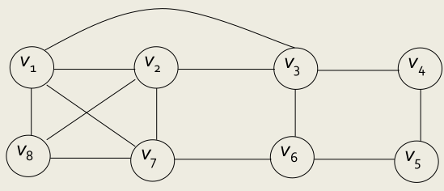
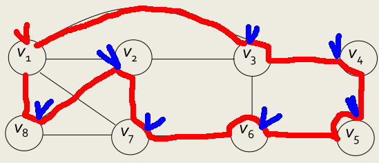

+++
title = "Hamilton circuit Problem"
description = ""
date = 2023-06-08
toc = true

[taxonomies]
categories = ["Backtracking"]
tags = ["algorithm", "Backtracking"]

[extra]
math=true
+++

---
# Hamilton Circuit(Tour)
- <txtylw>**Hamilton Circuit**</txtylw> 이란, 주어진 그래프 $G$ 에서 출발 vertex 인 $v_s$ 를 시작으로 <txtred>모든 vertex</txtred>를 <txtred>한 번씩</txtred> 방문한 뒤, 다시 $v_s$ 로 돌아오는 경로를 의미합니다.



- 예를 들어, 위와 같은 그래프 $G$ 에 대하여, 시작점을 $v_1$ 라 두었을 때



- 위 그림과 같이 $(v_1, v_3, v_4, v_5, v_6, v_7, v_2, v_8)$ 의 경로를 따라가면 <txtylw>Hamilton Circuit</txtylw>을 만들 수 있음을 확인할 수 있습니다.

---
# State Space Tree
- <txtylw>Hamilton Circuit</txtylw> 의 <txtylw>State Space Tree</txtylw>는 아래와 같이 구성됩니다.
> - <txtred>Root node</txtred> 에는 시작점을 놓습니다.
> - <txtred>Level 1</txtred> 에는 다음에 방문할 점을 놓습니다.
> - 반복적으로 <txtred>Level k</txtred> 에는 $(k-1)$ 번째 점을 제외하고 방문할 점을 둡니다.

---
# Promising
- 여기에 <txtred>Backtracking</txtred>을 위해 추가될 Promising 조건들은 다음과 같습니다.
> - $i$ 번째 정점은 반드시 $(i-1)$ 번쨰 정점과 <txtred>연결</txtred>되어 있어야 합니다.
> - $(n-1)$ 번쨰 정점은 반드시 <txtylw>시작점</txtylw>과 <txtred>연결</txtred>되어 있어야 합니다.
> - $i$ 번쨰 정점은, 앞서 경로에 추가된 다른 정점들과 <txtred>중복</txtred>되어서는 안됩니다.

---
# Algorithm
- 이를 알고리즘으로 작성하면 아래와 같습니다.

```cpp
void hamiltonian (index i) {
  index j;
  if (promising(i)) {
    // Solution
    if (i == n - 1) {
      for (int i = 0; i < n; i++)
        cout << vidx[0] << ' ';
    }
    else {
      for (j = 2; j <= n; j++) {
        // 일단 다음 경로에 집어넣기 
        vidx[i + 1] = j;
        hamiltonian(i + 1);
      }
    }
  }
}

bool promising (index i) {
  index j;
  bool switch;

  // n-1 번째 정점은 시작점과 연결되어 있어야 함
  if (i == n-1 && !w[vidx[n-1]][vidx[0]])
    switch = false;

  // i 번째 정점은 i-1 번째 정점과 연결되어 있어야 함
  if (i > 0 && !w[vidx[i-1]][vidx[i]])
    switch = false;

  // i 번째 정점은 이전 경로에 나타난 정점과 중복되지 않아야 함
  else {
    switch = true;
    j = 1;

    while (j < i && switch) {
      if (vidx[i] = vidx[j])
        switch = false;
      j++;
    }
  }

  return switch;
}
```

---
# Analysis
- <txtred>*Worst Time*</txtred> 으로 생각해보면, 이전의 선택한 정점을 제외한 모든 정점들을 선택할 수 있습니다. 따라서, 아래 수식으로 표현할 수 있습니다.

$$O(n) = 1 + (n-1) + (n-1)^2 + \cdots + (n-1)^n = \frac{(n-1)^{n+1} - 1}{n-2}$$

- 상당히 느린 알고리즘이지만, 모든 도시를 방문할 수 있는 경로 하나만 찾는다고 생각하면 TSP 보다 효율적으로 답을 내놓을 수 있다고 한다.

---
# Ref
- [blog](https://seungjuitmemo.tistory.com/107)
