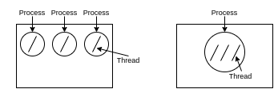
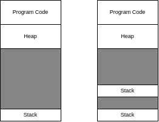

+++
title = "OS: Threads"
description = "Threads"
date = 2023-05-30
toc = true

[taxonomies]
categories = ["OS"]
tags = ["OS", "Concurrency", "Threads"]

[extra]
math=true
+++

*2023 Spring, PNU, CB26044 (Professor Ahn)*

---

# Motivation
`OS`는 `Process`라는 추상화를 통해 각각의 작업을 독립적으로 구분하게 되었습니다. 이는 작업 간 충돌 등을 방지하여 프로그램을 보다 안전하게 동작하도록 해줍니다.

하지만, 여러 개의 `Process`를 동시에 수행하고 싶은 상황에서는 이런 <txtylw>독립적인 상황</txtylw>이 오히려 <txtred>**단점**</txtred>이 될 수 있습니다.

예를 들어, $k$ 개의 `Process` 를 병렬적으로 실행하여 임의 작업을 수행하는 상황을 가정해봅시다. 각 `Process` 는 서로 독립적인 ***Address Space***(stack 등)을 가져야하며, ***Context Switch*** 를 통해야 이전 작업을 이어나갈 수 있습니다. 즉, `Process` 하나에 수반되는 비용이 **꽤 크다**는 것을 알 수 있습니다.

`Process`의 이점은 최대한 살리며, <txtylw>*Concurrency*</txtylw> 특성을 가질 수 있도록 추가되는 개념이 바로 `Thread` 입니다.

---

# Thread
이제까지는 <txtylw>하나</txtylw>의 `Program` 이란 <txtylw>하나</txtylw>의 `Process` 를 의미했습니다. 그리고, <txtylw>하나</txtylw>의 `Process` 내에서는 <txtylw>하나</txtylw>의 <u>***실행 흐름***</u> 만이 존재했습니다. 이 <u>***실행 흐름***</u> 은 `PC (program counter)` 레지스터로 관리됩니다.

`Thread` 는 하나의 `Process` 내에 <txtred>다수</txtred>의 ***실행 흐름*** 을 가질 수 있게 합니다. 



위 그림은 `single-thread` 와 `multi-thread` 각각의 상황을 표현한 그림입니다.

---

## Context Switch
`Process` 의 경우 ***Context Switch*** 를 위해 `PC`를 비롯한 *레지스터 정보* 를 <txtylw>PCB</txtylw> `(Process Control Block)` 라는 구조체로 관리했습니다.

`Thread` 도 이와 마찬가지로 <txtylw>TCB</txtylw> `(Thread Control Block)` 구조체를 통해 *레지스터 정보* 를 저장하고 관리합니다.

예를 들어, $T_1, T_2$ 라는 이름의 두 `Thread` 가 한 프로세스에서 돌아가고 있다고 가정해보겠습니다. 현재 $T_1$ 이 수행되다가 $T_2$ 로 ***Context Switch*** 가 일어난다면 다음의 절차를 따르게 됩니다.

> 1. $T_1$ 의 ***레지스터 정보*** 가 저장됩니다.
> 2. $T_2$ 의 ***레지스터 정보*** 를 불러옵니다.

주목할 점은, 두 `Thread` 가 같은 ***Address Space*** 를 <txtred>공유</txtred>하고 있다는 점입니다. 따라서, *Page Table* 을 통해 Address Space 를 갱신한다든지 하는 과정이 필요 없습니다. 즉, 여러 작업을 병렬로 수행할 때 훨씬 **효율적**임을 알 수 있습니다.

---

## Stack
`Process` 내에서 동작하는 다수의 `Thread` 는 각각 독립적인 ***Stack*** 영역을 갖습니다. 이는 <txtylw>하나</txtylw>의 ***Stack*** 영역이 자라거나 줄어들며 공간을 관리하던 것과는 달리, 완전히 <txtylw>독립적인 영역</txtylw>을 사용한다는 점에서 차이가 있습니다. 



위 그림은 이를 표현한 ***Address Space*** 입니다.

좌측은 `single-thread` 이며, 우측은 `two thread` 임을 나타냅니다.

---

## Processes vs. Threads
`Process` 와 `Thread` 간의 관계를 토대로 정리해보면 아래와 같습니다.
> - 하나의 `Process` 는 다수의 `Thread` 를 담는 ***Container*** 와 같은 역할을 한다.
> - `Thread` 는 <txtylw>동일한 ***Address Space*** 를 공유</txtylw>하고, 이는 상호작용이 보다 쉽게 일어남을 의미한다.
> - `Thread` 는 <u>***Scheduling***</u> 의 단위가 되며, <txtylw>TCB</txtylw> 를 이용해 <u>***Context Switch***</u> 가 일어난다.
> - `Process` 는 정적으로 존재하며, 그 내부에서 동적으로 `Thread`가 생성되고 소멸되는 양상이다.

---

## Benefits of Multi-threading
`Thread` 를 활용하면, ***Concurrency*** 를 보다 <txtylw>저렴하게 구현</txtylw>할 수 있습니다.

또, 큰 작업을 작은 작업으로 세분화하여 프로그램의 <txtylw>구조를 효율적으로 향상</txtylw>시킬 수 있습니다.

예를 들어, `I/O` 작업이 발생했을 때 다른 `Thread`로 빠르게 ***Ctxt Switch*** 를 일으켜서 전체적인 <txtylw>Throughput</txtylw> 을 높이거나, ***웹 서버*** 등에서의 작업처럼 동시다발적으로 발생하는 `Event` 를 핸들링 할 수 있는 <txtylw>Responsiveness</txtylw> 를 향상시킬 수 있습니다.

마지막으로, `Thread` 를 이용하면 `CPU` 의 멀티코어를 이용해서 <txtylw>***병렬 프로그래밍***</txtylw> 을 할 수 있습니다.

---

## Thread 적용

`Thread` 를 적용하는 방법에는 크게 두 가지가 있습니다. 하나는 `OS`의 <txtylw>Kernel</txtylw> 을 이용하는 것이고, 또 다른 하나는 <txtylw>***user library***</txtylw> 를 이용하는 것입니다.

---

### 1. Kernel-Level Thread
`OS` 가 직접 `Thread` 를 관리하는 경우입니다.

`Thread` 에 관련된 작업(operation)은 <txtylw>Kernel</txtylw> 에 정의되어 있습니다. 따라서, `Thread` 를 생성하고 관리할 때는 <txtred>System Call</txtred> 을 이용해야 합니다. 그리고, 이렇게 관리되는 `Thread`들은 `OS` 에 의해 <txtylw>***Scheduling***</txtylw> 됩니다. 따라서, `OS` 가 제공하는 안정성을 기반으로 각 `Thread` 를 `Kernel` 에서 개별적으로 관리할 수 있다는 장점이 있습니다.

그러나, `Kernel` 을 통해 작업을 해야 하기 때문에 <txtred>비용이 높다</txtred>는 단점이 있습니다. 또, `Kernel`에서 각 `Thread` 를 저장하고 관리하기 위한 상태를 지속적으로 관리해줘야 하므로, 확장 문제와 비용 문제가 존재합니다.

---

### 2. User-Level Thread
- `Library`로 `Thread` 를 관리하는 기능을 구현하여 사용하는 경우입니다.

`Thread` 는 `Process` 의 ***Address Space*** 를 공유하기 때문에, `user-level` 에서의 `library` 로도 이를 구현할 수 있습니다.

이렇게 되면, 각 `Process` 내에 `Thread` 를 위한 `Thread Table`이 존재하게 됩니다. 따라서, <txtred>System Call</txtred>을 호출할 필요가 없으며 앞서 언급된 <txtred>단점</txtred>인 무겁고 비용이 비싼 문제들은 없습니다.

`OS`에서는 `Thread`에 대한 시야가 없습니다. 따라서, 다음과 같은 조금 아쉬운 결정들을 행하게 됩니다.
> - `thread` 를 ***BLOCK*** 하려면 전체 `Process` 를 ***BLOCK*** 하게 됩니다.

또한, `multi-core` 의 장점을 살릴 수도 없으며 blocking system call 을 non-blocking system call 을 이용해 library 상에서 emulate 해야합니다.

---

# code
`POSIX Threads` 인 `Pthreads` 를 이용해 `thread` 를 생성하고 관리할 수 있습니다.

## thread 생성
> `pthread_create()` 함수 이용

```c
#include <stdio.h>
#include <pthread.h>

typedef struct __myarg_t {
  int a;
  int b;
} myarg_t;

void *mythread(void *arg) {
  myarg_t *m = (myarg_t *) arg;
  printf("%d %d\n", m->a, m->b);
  return NULL;
}

int main(int argc, char *argv[]) {
  pthread_t p;
  int rc;

  myarg_t args;
  args.a = 10;
  args.b = 20;

  // thread 생성
  rc = pthread_create(&p, NULL, (void *) mythread, &args);

  return 0;
}
```

- 위 코드를 컴파일한 후 실행시켜보면 thread 가 생성된 후 완료된다는 <u>보장이 없습니다</u>.

---

## thread 기다리기
> `pthread_join()` 함수 이용

```c
#include <stdio.h>
#include <pthread.h>
#include <assert.h>
#include <stdlib.h>

typedef struct __myarg_t {
  int a;
  int b;
} myarg_t;

typedef struct __myret_t {
  int x;
  int y;
} myret_t;

void *mythread(void *arg) {
  myarg_t *m = (myarg_t *) arg;
  printf("%d %d\n", m->a, m->b);
  myret_t *r = malloc(sizeof(myret_t));

  r->x = 1;
  r->y = 2;
  return (void*) r;
}

int main(int argc, char *argv[]) {
  int rc;
  pthread_t p;
  myret_t *m;

  myarg_t args;
  args.a = 10;
  args.b = 20;

  pthread_create(&p, NULL, mythread, &args);
  pthread_join(p, (void **) &m);

  printf("returned %d %d\n", m->x, m->y);
  return 0;
}
```

---

# Reference
- Tistory 블로그: [user-level, kernel-level](https://happy-chipmunk.tistory.com/20)

