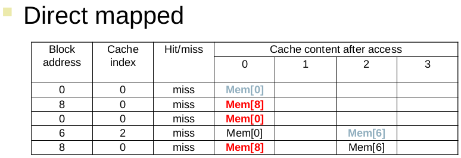
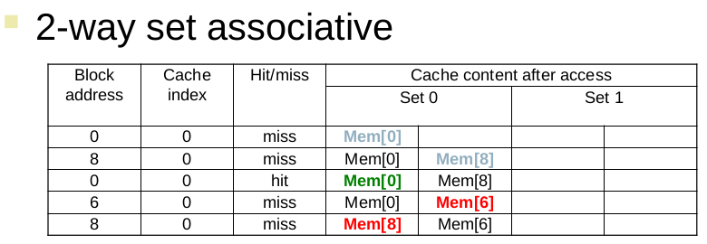
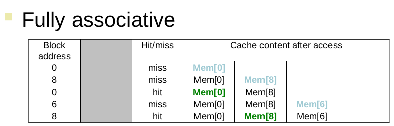
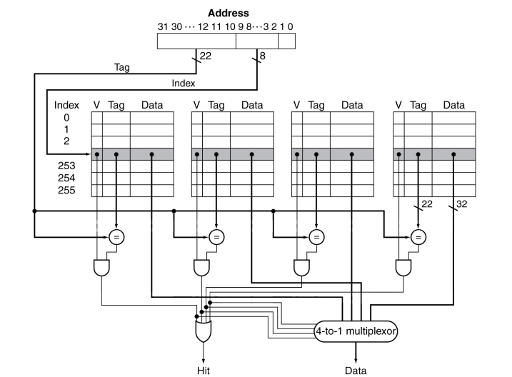
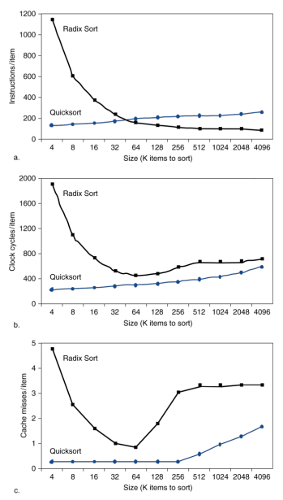

+++
title = "CompArch 24MAY2023"
description = "Note"
date = 2023-05-24
toc = true

[taxonomies]
categories = ["CompArch"]
tags = ["Memory", "Quick Note"]

[extra]
math=true
+++

---

# Cache
> - Directed
> - Fully
> - Associative

---

## Example
- Block Access 가 0, 8, 0, 6, 8 이라고 가정

### Directed

### 2-way set Associative

### Fully Associative

- <txtylw>Cold Miss</txtylw> 는 피할 수 없음

---

- Associativity 를 증가시키면, Miss Rate 가 감소함
> - 1-way: 10.3%
> - 2-way: 8.6%
> - 4-way: 8.3%
> - 8-way: 8.1%
- *왜 $1$ -> $2$ 일 때만큼 계속해서 크게 줄어들지 않을까?*
  - Associativity 의 증가 -> 하드웨어 복잡도 증가 ??

---

## Set Associative Cache
- H/W 로 표현하면 아래와 같음

- 여러 `Set`들 중 **하나라도** <txtylw>Hit</txtylw>라면, **Hit** 임

---

## Replacement Policy
- Direct mapped: 선택의 여지가 없음
- Set Associative: LRU 같은 것을 사용하면 됨
- ***Fully Associative***: Cache 가 가득차면 적절한 정책이 필요함
 
 
- LRU: 제일 오래 안 쓴 것을 내보냄
- Random: 생각보다 괜찮음

---

## Multi-Level Cache
- Cache 가 2개 이상 있다는 것
 
 
- 가정
  - CPU base CPI = 1, Clock Rate = 4GHz
  - Cache Missrate = 2%
  - Main Memory Access Time = 100ns
 
 
  - Miss Penalty = $100ns / 0.25ns = 400 cycles$
  - <txtred>Effective CPI</txtred> = $1 + 0.02 \times 400 = 9$
    - 즉, <txtylw>*Miss Penalty*</txtylw> 때문에 CPI 가 1에서 9가 됨;;
    - 겨우 $2%$ 의 missrate 가 불러오는 영향이 큼
      - 즉, Cache 성능이 <txtred>아주 중요</txtred>하다.
- `L-2 cache` 가정
  - Access Time = 5ns
  - Global missrate to main memory = 0.5%
 
 
  - Primary miss with L-2 hit
    - Penalt = 5ns / 0.25ns = <u><txtylw>20 cycles</txtylw></u>
  - Primary miss with L-2 miss
    - Extra Penalt = 5ns / 0.25ns = <u><txtylw>20 cycles</txtylw></u>
  - CPI = $1 + 0.02 \times 20 + 0.005 \times 400 = 3.4$
    - 즉, `L-2 Cache` 를 추가하면 *Penalty* 에 의한 CPI 증가를 상대적으로 <txtylw>줄일 수 있음</txtylw>

---

- `Primary Cache` 는 *Hit* 했을 때 접근하는 시간을 낮추는 것이 중요
  - ***빠르게 동작하는게 핵심***
- `L-2 Cache`
  - 메인메모리 접근을 최소화 하는 것이 중요
    - Penalty 를 먹기 때문
- 각 계층마다의 Cache block size 가 $k$ word 로 서로 다름
  - 상위 계층으로 갈수록 block size 가 상대적으로 작음

---

- `Memory Miss` 는 어떻게 메모리에 접근하느냐에 따라 크게 달라질 수 있음

- `Radix Sort` 의 <txtred>*Cache Miss*</txtred> 가 특정 크기 ($k$) 를 기점으로 급격하게 증가한 것을 볼 수 있음

---

## DGEMM Code Example
- `Double precision General Matrix Multiplication` 연산에 관한 Cache 동작 확인

---

cache done

---

# Main Memory

## Dependability
- Service 의 failure, System 의 failure 에 관한 내용
- 용어
  - Reliability: `MTTF`(<txtylw>Mean Time To Failure</txtylw>)
  - Service Interruption: `MTTR`(<txtylw>Mean Time To Repair</txtylw>)
  - `MTBF`(<txtylw>Mean Time Between Failures</txtylw>) = `MTTF` + `MTTR`
  - <txtred>Availability</txtred>(가용성) = `MTTF` / (`MTTF` + `MTTR`)
    - Increase `MTTF`: fault tolerance <del>고장이 덜 나게 함</del>
    - Reduce `MTTR`: <del>수리(복구)를 빠르게 함</del>

---
- `Fault` 에 대해 `복구`를 진행하는 개념이 메인메모리에서 필요하기 때문?
---

## Hamming SEC Code
- *Hamming distance*
  - 두 bit pattern 사이의 차이 정도
- `Parity Bit` 를 넣어주면, $1$-bit 라도 차이가 나면 <txtred>error detection</txtred> 가능

### Encoding SEC
- `Parity Bit` 가 4개인 이유
  - *Bit Position* 이 4-bit 로 표현되어야 하기 때문
- 만약 `Parity Bit` 가 아닌 bit 에서 에러가 난다면?
  - `Parity Bit` 위치의 총 개수에 변화가 생겼기 때문에, 해당 `Bit` 의 위치를 알아낼 수 있음

---

### Decoding SEC
- `Parity Bit` 가 `0000` 이라면, Error 검출이 불가능하기 때문에 $1$ 부터 시작함

---

### SEC/DEC Code
- <txtylw>**Single**</txtylw> Error Correction
- <txtylw>**Double**</txtylw> Error Correction
 
 
- System Parity Bit 가 전체 word 에 대해 보완을 해줌

---

# VM Machine
