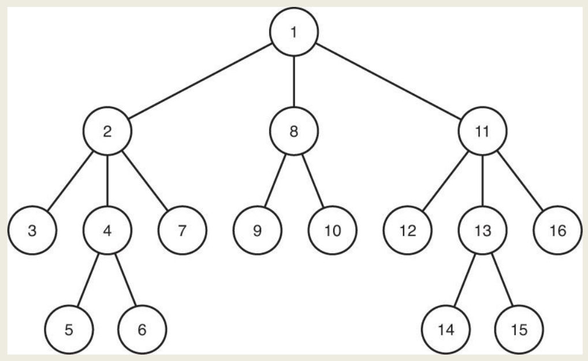
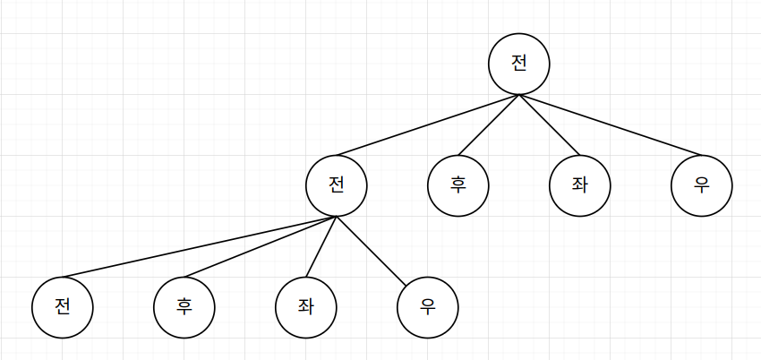

+++
title = "Backtracking"
description = "Backtracking Algorithm"
date = 2023-04-25
toc = true

[taxonomies]
categories = ["Algorithm", "Lect"]
tags = ["Algorithm", "Lect", "backtracking"]

[extra]
math=true
+++

---

*2023 Spring, PNU, CB20337 (Professor Lee)*

# Backtracking
- `Backtracking`을 이해할 때 `미로 (maze)` 를 탈출하는 과정을 생각해 볼 수 있습니다.
- 길을 선택할 때, 각 길이 어떤 결과를 초래할지는 모르지만 출구로 가는 길을 기대하며 선택합니다.
- 선택 이후에 또 다음 선택이 이어집니다.
- 모든 길을 돌아다녀봤다면, 어쨌든 출구를 찾을 수는 있습니다.
---
- 즉, 특정 `Set` 으로부터 선택된 객체들의 `Sequence` 가 어떠한 `기준`을 만족하는 문제를 해결할 때 쓰일 수 있는 방법입니다.
- 그리고, `Backtracking` 은 `DFS` 의 변형입니다.
- ***preorder*** traversal dfs 알고리즘은 아래와 같습니다.
```c
void depth_first_tree_search(node v)
{
  node u;

  visit v;

  for (each child u of v) 
  {
    depth_first_tree_search(u);
  }
}
```
- 위에서 *each child* 라고 명시한 부분에 (*left to right*) 라는 정보가 내포되어 있다고 가정하면, 아래와 같은 트리를 확인할 수 있습니다.


<center>
출처: Lecture Slide 
</center>

---
# State Space Tree
- 만약 미로를 탈출하는 문제가 주어졌다고 가정한다면, 아래와 같이 길을 따라 움직이는 경우를 나열할 수 있습니다.
- 좀 더 형식적으로 말하자면, 각 경우는 `Root부터 Leaf에 도달하기까지의 경로` 입니다.
- 즉, *candidate solution* 이라고도 할 수 있습니다. (leaf 가 exit 일 경우는 ***solution***)
```
(전), (후), (좌), (우) 로 움직일 수 있다고 할 때

[(전), (전), (전), (전), ...]
[(전), (좌), (전), (전), ...]
[(전), (우), (전), (전), ...]
[(전), (후), (전), (전), ...]
[(전), (좌), (우), (전), ...]
```
- 그리고, 이러한 경우들을 ***Tree*** 구조로 나타낸 것을 `State Space Tree`라 합니다.



- 각 path 의 노드 중, ***solution*** 으로 이어지는 node 를 `Promising(node)` 이라 부릅니다.
- 또, `Nonpromising` 일 경우, 바로 부모 노드로 backtracking 해버리는 방법을 `pruning` 이라 부릅니다. (*가지치기*)
- `Backtracking` 은 이렇게 정리된 `pruned state space tree` 에서 진행하는 `DFS` 라 생각하면 됩니다.
- `Backtracking` 의 일반적인 코드는 아래와 같이 적을 수 있습니다.
```c
void checknode (node v)
{
  node u;
  
  if (promising(v))
    if (there is a solution at v)
      write the solution;
    else
      for (each child u of v)
        checknode(v);
}
```
- `promising` 함수는 각 `Backtracking` 문제마다 달라집니다.
- 또, `Backtracking` 은 실제로 `Tree` 를 만들 필요 없이 *implicitly* 존재한다고 생각하고 문제를 풀 수도 있습니다.

---
