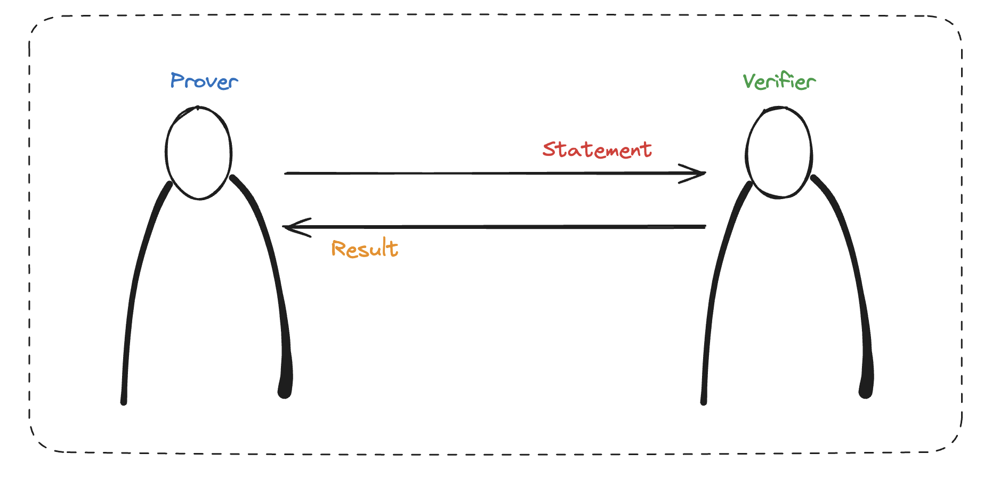

+++
title = "Why and how zk-SNARK works (1)"
date = "2024-04-15"
+++

> 본 포스트는 Maksym Petkus 의 [why and how zk-snark works](https://arxiv.org/abs/1906.07221) 를 읽고 정리한 내용을 포함하고 있습니다.

# 1. 들어가며
`zk-SNARK` (Zero-knowledge Succinct Non-interactive ARgument of Knowledge) 는 "정보를 공개하지 않고도 증명 할 수 있는" 기발한 방법입니다.
그러나, 이 방법이 왜 유용한지 우선 이해할 필요가 있습니다.

`Zero-Knowledge Proof` 가 유용하게 활용될 수 있는 분야는 크게 아래 네 가지가 있습니다.
- ***프라이빗 데이터에 대한 증명*** 
    - 데이터를 보여주지 않고도 소유를 증명할 수 있습니다.
- ***익명 사용자에 대한 인증***
    - 신원정보 없이도 접근 권한 등을 인증할 수 있습니다.
- ***익명 지불***
    - 신원정보 등이 없어도 적법한 지불임을 증명할 수 있습니다.
- ***연산 아웃소싱***
    - 많은 자원이 필요한 연산을 수행할 때, 외부 자원에 위임하면서도 올바르게 수행되었음을 증명할 수 있습니다.
    - "수행되었음"을 다시 수행해보지 않고서도 증명할 수 있습니다.

이처럼 굉장히 유용해보이는 이 암호학적 기술은 깊은 수준의 수학적, 암호학적 이론을 바탕으로 합니다.
1985년에 처음으로 
[[GMR85](https://people.csail.mit.edu/silvio/Selected%20Scientific%20Papers/Proof%20Systems/The_Knowledge_Complexity_Of_Interactive_Proof_Systems.pdf)] 
논문에서 개념이 소개되었으며, 이후 `non-interactive`, `succinct` 등의 개념이 추가되며 발전해왔습니다.

*zero-knowledge proof* 시스템에서는 아래 그림과 같이 두 종류의 주체가 등장합니다.

| 역할 | 설명|
| --- | --- |
| `prover` | `verifier`에게 *정보* 에 대한 ***statement*** 를 납득시키려는 주체 |
| `verifier` | `prover`의 ***statement*** 를 검증하는 주체 |

또한, 모든 *ZKP* 프로토콜은 아래 세 성질(property)을 만족해야 합니다.

| property | 설명|
| --- | --- |
| `Completeness` | ***statement*** 가 *True* 라면, `prover` 는 `verifier` 를 납득시킬 수 있습니다. |
| `Soundness` | 잘못된 ***statement*** 로는 `verifier` 를 납득시킬 수 없습니다. 즉, 속임이 불가능합니다. |
| `Zero-Knowledge` |두 주체 간의 상호작용에서, ***statement*** 의 진위여부 외에는 알 수 있는 정보가 없습니다.|

---

# 2. 증명의 매개체

어떠한 정보 $A$ 를 알고 있다는 사실을 증명하는 방법은 가장 손쉬운 방법은 $A$를 보여주는 것입니다.
그러나, `zero-knowledge proof` 에서는 오직 **증명**만으로 **정보에 대한 주장**을 검증해야 합니다.

## 2-1. 배열

정보를 드러내지 않으면서도 주장을 검증하는 아주 간단한 예를 하나 들어보겠습니다.
아래 그림과 같이 길이가 $10$인 배열(*array*) 가 하나 있다고 해보겠습니다.
이 배열은 바이너리 값을 원소로 가집니다.
즉, 원소 $e$ 는 $e \in \\{0, 1\\}$ 입니다.

이제 `Prover`가 아래의 주장을 한다고 해봅시다.
> "*배열의 모든 원소는 $1$이다.*"

배열을 드러내지 않으면서도 이 주장을 검증하는 방법으로는 어떤 것이 있을까요?
단순한 방법은 `Verifier`가 $10$ 개의 원소 중 임의로 하나를 선택하여 확인해보는 것입니다.
$k$ 번째 원소를 선택하고 확인된 값이 $1$ 이었다고 해보겠습니다.
이는 `Verifier` 가 `Prover`의 주장에 대해 $\frac{1}{10}=10\\%$ 의 `확신`을 할 수 있음을 의미합니다.

만약 이러한 `확신`이 $50\\%$ 이상일 때만 `Prover`의 주장을 **참**으로 검증한다면,
이러한 검증을 $5$번 해야 합니다.
만약 $95\\%$ 이상이 요구된다면, $10$ 개의 원소 모두에 대한 검사가 이루어져야 합니다.
직관적으로 이러한 검증 방식은 배열의 크기가 $N$ 일 때 $O(N)$ 의 복잡도를 갖게 됩니다.
따라서, 이보다 나은 방법이 필요합니다.

## 2-2. 다항식 (polynomial)
결론부터 이야기하자면, 다항식을 활용하는 방식은 배열보다 훨씬 효율적입니다.
예를 들어, 아래와 같은 다항식 $f(x)$ 가 있다고 해보겠습니다.

$$
\begin{align}
f(x) = x^3 - 6x^2 + 11x - 6
\end{align}
$$

다항식 $f(x)$ 는 $x=1, 2, 3$ 일 때 $y=0$ 임을 확인할 수 있습니다.
또한, $(1, 0), (2, 0), (3, 0)$ 을 제외하면 그 어디서도 $y=0$ 일 수 없습니다.

조금 더 일반적으로 생각해보겠습니다.
[대수학의 기본정리](https://en.wikipedia.org/wiki/Fundamental_theorem_of_algebra)에 따라, 
최고차항의 차수(*degree*)가 $d$ 인 다항식 $f(x)$는 최대 $d$ 개의 해를 갖습니다.
임의의 상수 $k$ 에 대하여, 다항식 $g(x) = f(x) - k$ 도 역시 최대 $d$ 개의 해를 갖는다는 것을 쉽게 알 수 있습니다.
따라서, $f(x) = k$ 를 만족하는 $x$ 의 값은 최대 $d$ 개가 있습니다.

이제 `Prover` 가 아래와 같은 주장을 한다고 해봅시다.
> "*다항식 $f(x)$ 를 알고 있다.*"

- 실제 다항식(진리값) $f(x)$ 와 구별하기 위해 `Prover`가 공개하지 않은 채 "실제로 알고 있는" 다항식을 $f'(x)$ 로 구별해서 표시합니다.

앞서 살펴본 다항식의 성질을 이용해 아래와 같이 *단순한 형태의 프로토콜* 을 생각할 수 있습니다.

| | | 방향 | | 설명 |
| --- | --- | --- | --- | --- |
| 1 |  |  | `Verifier` | `Verifier` 는 임의의 값 $t$ 에 대하여, $f(t) = v$ 를 미리 계산합니다. |
| 2 | `Prover` | $\leftarrow$ | `Verifier` | `Verifier` 는 `Prover` 에게 값 $t$를 보냅니다. |
| 3 | `Prover` |  |  | `Prover` 는 $f'(t)=v'$ 를 계산합니다.  |
| 4 | `Prover` | $\rightarrow$ | `Verifier` | `Prover` 는 `Verifier` 에게 계산된 값 $v'$ 를 보냅니다. |
| 5 |  |  | `Verifier` | `Verifier` 는 $v = v'$ 임을 검사하여 주장의 진위여부를 검증합니다. |

이렇게 다항식(*polynomial*)을 이용한 방식은 배열을 이용했을 때보다 훨씬 간단하게 `높은 확신`을 줄 수 있습니다.
임의의 정수 $t$ 값을 $1$ 부터 $10^{77}$ 사이에서 고르고, `Verifier` 가 계산한 값 $v$ 에 대하여 다항식 $g(x)$ 가 아래와 같을 때,
$$g(x) = f(x) - v  \qquad (\text{where} \quad f(t) = v)$$
$g(t) = g(x') = 0$ 이 되도록 하는 $x'$ 은 최대 $d$ 개 존재합니다.
따라서, `Prover` 가 제시하는 $v'$ 가 유효할 확률은 $\frac{d}{10^{77}}$ 입니다.
이는 상당히 낮은 확률로써, 충분히 신뢰할만한 수치입니다.

---

# 정리

이번 포스트에서는 *ZKP* 시스템의 구조와 특성, 그리고 다항식(*polynnomial*)을 사용했을 때의 유용함을 살펴보았습니다.
현재까지 살펴본 단순한 프로토콜도 *zero-knowledge* 를 만족한다고 볼 수 있습니다.
하지만, 아직 많은 문제점을 안고 있으며 이를 차근 차근 개선해나가는 식으로 논문이 전개됩니다.

---
