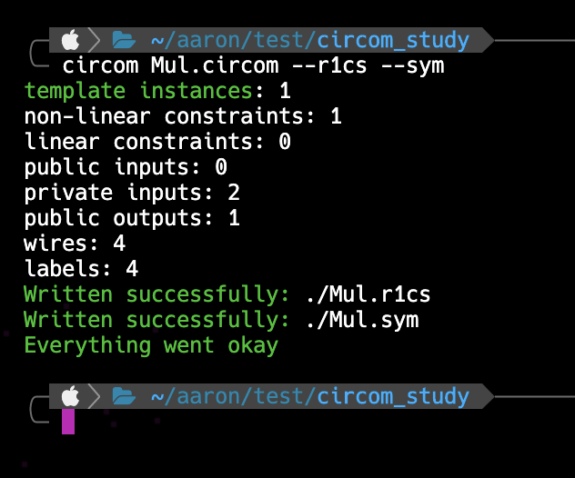

+++
title = "circom 이해하기"
date = "2024-04-29"
+++

`circom`은 **zk-SNARK** 를 이해하고 활용하는데 아주 좋은 도구입니다.
하지만, 상당히 *low-level* 을 다루기 때문에 미세한 버그들이 일어날 수 있는 가능성도 존재합니다.
`circom`보다는 *High-level Language* 에 해당하는 [ZKP language](https://www.rareskills.io/post/zero-knowledge-programming-language)를 사용하는 것이 좋다는 의견도 있습니다.

`circom`을 이용해 코딩할 때, [**R1CS**](https://www.rareskills.io/post/rank-1-constraint-system) 에 대해 아는 것이 훨씬 도움이 됩니다.
왜냐하면, `circom`은 사실 **R1CS**의 *wrapper* 로 동작하기 때문입니다.
따라서, **R1CS**를 이해하고 접근한다면 <u>*underconstrained*</u> 등의 ZKP관련 용어를 막힘없이 이해할 수 있습니다.

# Pre-requisite
- *circom*
- *snarkjs*

# Hello World
`circom` 에서의 `Hello World`프로그램은 두 수의 곱셈 프로그램입니다.

```circom
pragma circom 2.1.6;

template Multiply() {
    signal input a;
    signal input b;
    signal output output;

    output <== a * b;
}

component main = Multiply();
```

위 코드에 대해 아래 명령어를 입력하면, 컴파일이 되는지 확인할 수 있습니다.

```bash
circom Mul.circom
```

<center>

</center>

프로그래밍 언어로 작성된 **프로그램**과 대응되는 **R1CS** 를 생성합니다.

# Generating R1CS file
circuit 을 **R1CS** 파일로 변환하려면 아래와 같이 입력할 수 있습니다.
`--sym` 옵션을 추가해서 변환된 **R1CS** 내의 변수에 대한 정보를 저장해두겠습니다.

```bash
circom Mul.circom --r1cs --sym
```

<!-- 수정해야함 -->
<center>

</center>

아래와 같이 `snarkjs`를 이용해서 결과를 출력해볼 수도 있습니다.

```bash
snarkjs r1cs print Mul.r1cs
```

<center>

</center>

모든 연산이 유한체(finite field) 상에서 수행된다는 점을 생각해보면, 
`main.a` 앞에 있는 엄청 큰 수는 사실 $-1$ 임을 알 수 있습니다.
따라서, 위 그림의 식을 다시 정리해보면 아래와 같습니다.

$$
\begin{align}
(-1 \cdot a) * b - (-1 \cdot c) \equiv 0 (\bmod n)
\end{align}
$$

# Reference
- https://www.rareskills.io/post/circom-tutorial
