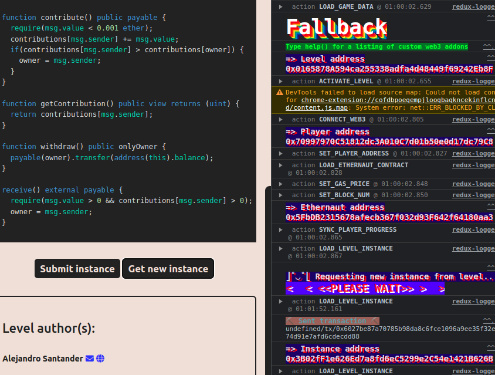
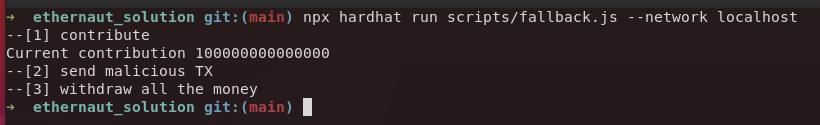

+++
title = "Fallback"
date = "2023-08-17"
+++

---

> My Solutions: [github](https://github.com/c0np4nn4/EtherStudy/tree/main/ethernaut_solution)

---

# Description
문제에서 제공하는 `FallbackFactory` 컨트랙트의 `validateInstance()` 함수를 살펴보면 아래와 같습니다.

<iframe
  src="https://carbon.now.sh/embed/9NMjLgxWcGhPipd6vZGv"
  style="width: 1024px; height: 298px; border:0; transform: scale(1); overflow:hidden;"
  sandbox="allow-scripts allow-same-origin">
</iframe>

아래 두 작업을 해야 문제를 해결할 수 있음을 알 수 있습니다.
- ***Owner*** 를 `player`로 변경 
- 돈을 ***0***으로 만들어야 함

## Contract
> `Fallback` 컨트랙트의 전문은 [Fallback Contract](https://github.com/OpenZeppelin/ethernaut/blob/master/contracts/contracts/levels/Fallback.sol)에서 확인할 수 있습니다.

이번에는 컨트랙트를 차근차근 살펴보겠습니다.

### State Variable
<iframe
  src="https://carbon.now.sh/embed/4luod14IHecpF0aOVEHR"
  style="width: 1024px; height: 208px; border:0; transform: scale(1); overflow:hidden;"
  sandbox="allow-scripts allow-same-origin">
</iframe>

우선 *state variable* 로는 `contribution` 과 `owner` 를 갖습니다.
`contribution`은 `address` 값에 대한 `uint256`을 매핑하고 있습니다.
이름 그대로 문제 컨트랙트에 얼마나 많은 기여를 했는지 체크하는 변수로 보입니다.
`owner`는 컨트랙트의 주인이 누구인지 명시하는 변수로 보입니다.

### Functions

#### constructor()
<iframe
  src="https://carbon.now.sh/embed/oWl5WCKzbPeH1ZC5L74v"
  style="width: 1024px; height: 267px; border:0; transform: scale(1); overflow:hidden;"
  sandbox="allow-scripts allow-same-origin">
</iframe>

`constructor()`를 보면 컨트랙트를 배포한 사람이 ***owner***가 되며,  ***1,000 ETH*** 만큼 기여한 것으로 초기화됨을 알 수 있습니다.

#### contribute()
<iframe
  src="https://carbon.now.sh/embed/568nwd4DY39HngQqa67u"
  style="width: 1024px; height: 339px; border:0; transform: scale(1); overflow:hidden;"
  sandbox="allow-scripts allow-same-origin">
</iframe>

`contribute()`를 보면 `contribution` *state variable*을 수정할 수 있습니다.
하지만, 한 번 contribute 할 때 *0.001 ETH* 이하의 값만 더할 수 있다는 제한이 걸려있습니다.
기존 주인의 `contribution` 값이 ***1,000 ETH*** 였으므로 gas를 논외로 생각하더라도 **100,000** 번의 트랜잭션을 보내야 새로운 ***owner***가 될 수 있습니다.

#### receive()
<iframe
  src="https://carbon.now.sh/embed/yeDL7jIu71tXpyGEEbrB"
  style="width: 1024px; height: 245px; border:0; transform: scale(1); overflow:hidden;"
  sandbox="allow-scripts allow-same-origin">
</iframe>

`receive()`는 `constructor()`와 비슷하게 ***function*** 키워드를 붙이고 있지 않습니다.
[Solidity Docs](https://docs.soliditylang.org/en/v0.8.12/contracts.html#receive-ether-function)에 따르면 아래와 같은 정보를 확인할 수 있습니다.
- ***calldata*** 가 비어있는 채로 `.send()` 나 `.transfer()`과 같은 일반적인 `ETH` 전송을 수행할 때 호출
- 만약 `receive()` 함수가 없을 때, *payable* 로 선언된 `fallback()`이 정의되어 있다면 이를 호출
- 만약 `receive()`나 `fallback()` 둘 다 없다면, **exception** 

`receive()`를 성공적으로 호출하기만 하면 ***owner*** 가 될 수 있으므로, 이 함수를 호출하도록 해봅니다.

---

# Exploit
우선 `Fallback` 컨트랙트의 Instance 를 생성하고 주소를 확인합니다.

> Instance address: ***0x3B02fF1e626Ed7a8fd6eC5299e2C54e1421B626B***

`Hardhat` 을 이용해 실행할 스크립트를 아래와 같이 작성합니다.

<iframe
  src="https://carbon.now.sh/embed/Roix6Hc3nrlv0er0Gvnq"
  style="width: 1024px; height: 1008px; border:0; transform: scale(1); overflow:hidden;"
  sandbox="allow-scripts allow-same-origin">
</iframe>

## 실행 결과

