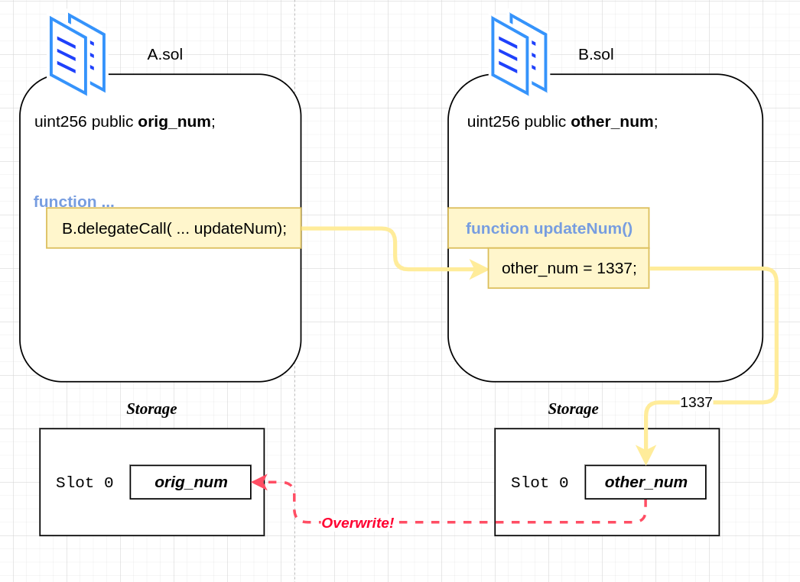
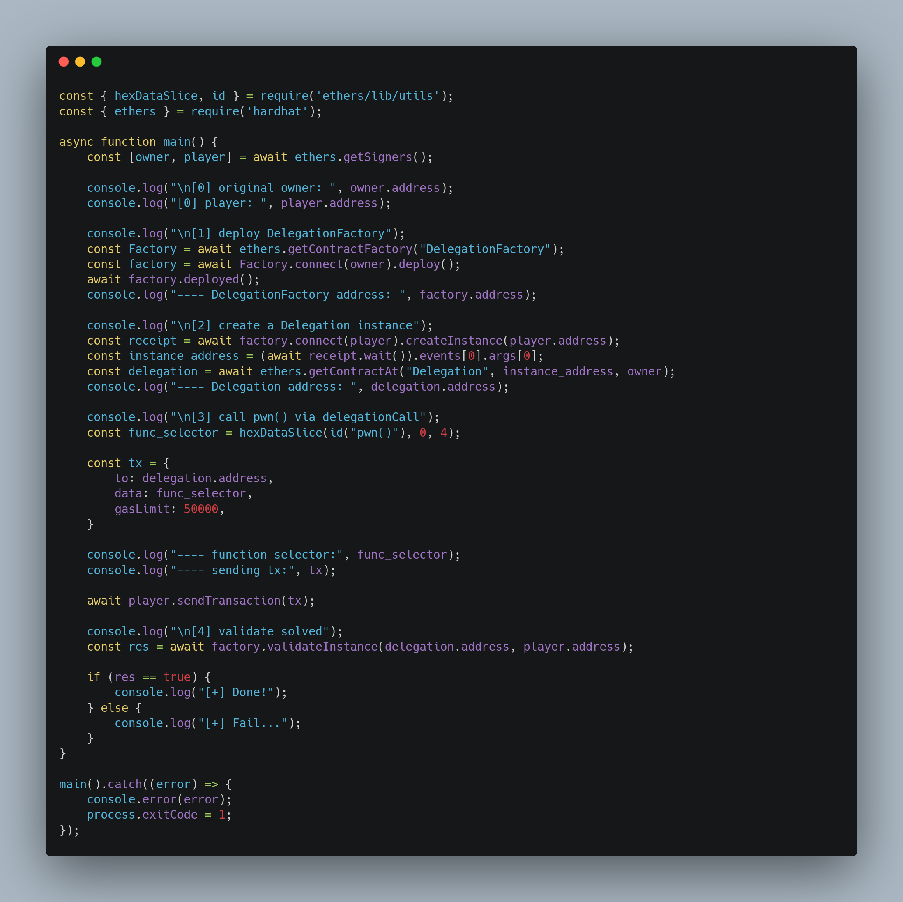

+++
title = "Delegation"
date = "2023-08-24"
+++

---

> My Solutions: [github](https://github.com/c0np4nn4/EtherStudy/tree/main/ethernaut_solution)

---

# TL;DR
> ***Delegation Call*** 과 ***storage slot***에 대한 문제입니다.

---

# Introduction
[delegateCall](https://solidity-by-example.org/delegatecall/)은 Solidity에서 제공하는 `low level function`으로, `call()`과 비슷하지만 차이점이 하나 있습니다.
바로, `Caller`에 해당하는 Contract의 context 중 `msg.sender`, `msg.value`, 그리고 `Storage`를 그대로 가져가서 `call`을 수행한다는 점입니다.
`Storage`를 그대로 가져간다는 점에서, Solidity 에서 [Storage Layout](https://docs.soliditylang.org/en/v0.8.17/internals/layout_in_storage.html)이 어떻게 관리되는지 알 필요가 있습니다.

---

# Problem Detail
## Goal
문제의 목표는 아래와 같이 `Delegation` 컨트랙트의 `owner`를 player로 바꾸는 것입니다.
> `Delegation` 컨트랙트의 `owner`가 바뀌어야 함을 유의해야합니다!

## Contract
이번 문제인 `Delegation`은 관련 컨트랙트들을 아래와 같이 배포하여 세팅합니다.

즉, `DelegationFactory.sol` 을 배포하면, `constructor()`가 `Delegate` 컨트랙트를 동시에 배포하도록 합니다.
이후 `createInstance`로 문제 컨트랙트인 `Delegation` 컨트랙트를 배포합니다.
`Delegation` 컨트랙트는 미리 배포되었던 `Delegate`의 주소 정보로 instance를 만들어서 ***Deleagte call*** 을 합니다.

`Deleagtion` 컨트랙트 코드 중 핵심이 되는 `delegateCall` 호출 부분을 살펴보겠습니다.

`fallback()` 함수를 통해 `delegateCall`을 호출함을 알 수 있습니다.

`Delegate` 컨트랙트를 살펴보면 아래와 같습니다.

주목할 점은, `pwn()`함수의 내용입니다.
`pwn()` 함수는 `Delegate` 컨트랙트의 상태변수 중 하나인 `owner`를 `msg.sender`로 수정합니다.
그런데, 앞서 살펴본 우리의 목표는 `Delegation` 컨트랙트의 `owner`를 수정하는 것입니다.
상태변수를 업데이트하는 코드가 `pwn()` 밖에 없으므로, 이를 잘 이용해야함을 알 수 있습니다.

`delegateCall`은 *Introduction* 에서도 언급했듯이 다른 컨트랙트에서 기존의 `msg.sender`, `msg.value`, 그리고 `Storage` 정보를 토대로 함수를 실행할 수 있게 해줍니다.
이는 곧, `Delegate` 컨트랙트에서의 상태변수 업데이트가 `Storage`에 영향을 미치기 때문에 `Delegation` 컨트랙트의 상태변수에도 변화가 생길 수 있음을 의미합니다.
그리고, 두 컨트랙트 모두 `owner` 라는 상태 변수를 첫 번째 상태 변수(`slot 0`)로 정의해두었기 때문에 간단히 **pwn** 할 수 있습니다.

`delegationCall`에 의해 ***storage overwrite*** 가 일어날 수 있는 한 시나리오입니다.
`Contract B`가 `delegateCall`의 `callee`가 되었을 때, `slot 0`위치의 값을 수정하면 `caller`인 `Contract A`의 `slot 0`위치의 값이 변경됨을 표현하고 있습니다.

---

# Exploit
## Strategy
우선 `Delegation` 컨트랙트에서 `fallback()`함수를 호출합니다.
`fallback()`함수는 `delegateCall`의 인자로 `msg.data`를 넘기는데, 여기 들어갈 내용은 아래와 같습니다.
> `pwn()` 함수 호출
`pwn()`함수가 호출되면 `slot 0`의 값이 *overwrite* 되므로, `Delegation`의 `owner`를 플레이어로 바꿀 수 있을거라 기대할 수 있습니다.

## Code
아래는 문제 해결을 위해 작성한 스크립트 입니다.

## Result
실행 화면은 아래와 같습니다.

앞서 설명하지 못한 내용 중 하나는 `function selector`에 관한 것입니다.
[Function Selector](https://solidity-by-example.org/function-selector/)란, 함수를 특정지어줄 수 있는 일종의 `키`입니다.
이는 `calldata`의 첫 ***4-byte*** 값으로 결정됩니다.
예를 들어, 'pwn()' 라는 함수 호출정보를 적절한 가공 (*keccak256으로 해싱*)을 거친 뒤 첫 *4-byte* 만 뽑아내는 식입니다.

---

# Conclusion
`delegateCall`은 컨트랙트의 context 를 그대로 가져가서 활용한다는 점에서 보안리스크가 크다고 볼 수 있습니다.
실제로, `delegateCall`을 응용해서 터진 사건이 유명한 [The DAO](https://blog.solidityscan.com/security-issues-with-delegate-calls-4ae64d775b76) 사건이라고 합니다.
따라서, `delegateCall`을 사용할 때는 `Storage` 구조 설계를 철저히 하고, 여러 보안 리스크들을 잘 파악해야 함을 알 수 있습니다.

