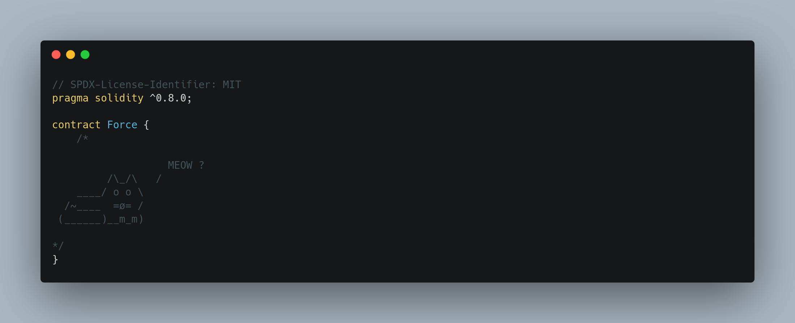
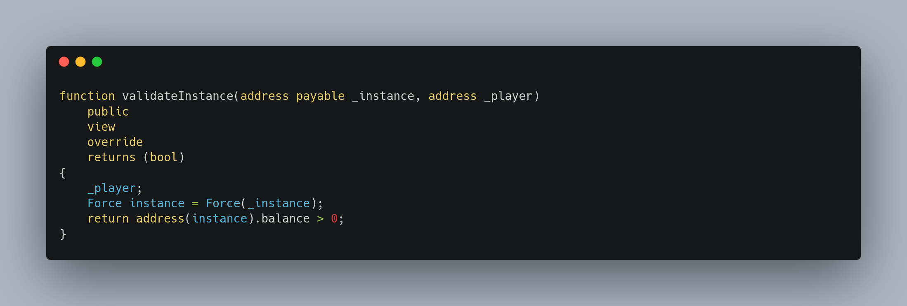

+++
title = "Force"
date = "2023-08-26"
+++

---

> My Solutions: [github](https://github.com/c0np4nn4/EtherStudy/tree/main/ethernaut_solution)

---

# TL;DR
> ***selfdestructor()*** 를 이용한 취약점 문제입니다.

---

# Introduction
[selfdestructor](https://solidity-by-example.org/hacks/self-destruct/)는 Solidity에서 제공하는 `low level function`입니다.
이 함수를 실행하면, *on-chain* 컨트랙트를 종료(삭제)할 수 있습니다.
주목할 점은 바로 컨트랙트가 갖고 있던 `Ether` 의 행방입니다.
만약 컨트랙트가 `100 ETH`를 갖고 있었다면, *selfdestructor()* 에 의해 삭제된 후, 해당 금액은 그냥 사라지게 되는 걸까요?
이번 문제에서는 `Ether`가 전송되는 방법들 중 하나인 *selfdestructor()* 에 관해 살펴보게 됩니다.

---

# Problem Detail

## Contract
**Ethernaut** 에서 제공하는 `Force.sol` 파일을 확인하면 조금 어리둥절합니다.
왜냐하면, 컨트랙트가 텅텅 비어있기 때문입니다.

## Goal
문제의 목표는 아래와 같이 `Force` 컨트랙트의 `balance`를 `0` 보다 큰 수로 바꾸는 것입니다.

그런데 어딘가 좀 이상합니다.
현재 `Force` 컨트랙트는 [[Fallback](@/posts/ethernaut_1.md)] 문제에서 살펴보았듯이, `ETH`를 받는 함수 `receive()`가 있는 것도 아닙니다.
또 `payable` 키워드의 유무를 따지기 전에, 컨트랙트 자체가 텅텅 비어있습니다.
이를 해결하기 위해서는 *`ETH`를 전송하는 여러 방법* 에 관해 우선 살펴볼 필요가 있습니다.

## How to send ETH?
컨트랙트가 `ETH`를 전송받는 방법은 크게 아래 세 가지가 있습니다.
> 1. `payable` 함수
>   - `fallback()`, `receive()` 등
> 2. <u>블록 채굴 보상</u>을 받도록 지정된 컨트랙트
>   - 컨트랙트 주소를 *블록 채굴 보상* 을 받는 주소로 지정할 수 있습니다.
> 3. <u>삭제된 컨트랙트</u>를 통해 지정된 컨트랙트
>   - 삭제되는 컨트랙트가 지정한 **특정 컨트랙트 주소**로 `ETH`가 전송됩니다.

이 중 `3번` 방법을 좀 더 살펴보면 아래와 같습니다.

`Contract A`가 만약 *selfdestruct()* 를 통해 삭제될 경우, <u>*address(B)*</u> 로 지정한 `Contract B`에 보유하고 있던 ***n ETH*** 를 전송합니다.
위 그림에서 볼 수 있듯이, 이 과정에서 `ETH` 전송을 검증하거나 막을 방법은 없습니다.

---

# Exploit
## Strategy
우선 <u>*selfdestruct()* 로 삭제됨과 동시에 `Force` 컨트랙트로 `ETH`를 전송</u>하는 `ForceAttack` 컨트랙트를 작성합니다.
배포된 `ForceAttack` 컨트랙트에 일정 `ETH`를 전송하고, *selfdestruct()* 를 트리거 하면 됩니다.

## Code
### ForceAttack.sol
우선 `ForceAttack` 컨트랙트입니다.

보시다시피, `attack()` 함수를 호출하면 지정된 `target`으로 보유하고 있던 `ETH`를 보냅니다.

### exploit.js
문제 풀이에 사용된 Javascript 코드입니다.

`ForceAttack` 컨트랙트를 배포한 후, `1 ETH`를 전송합니다.
이후 `attack()` 함수를 호출하여 *selfdestruct()* 를 트리거합니다.

## Result
실행 화면은 아래와 같습니다.

---

# Conclusion
`ETH` 를 전송하는 또 다른 방법에 대해 살펴볼 수 있었습니다.
다행인지, [EIP-6049](https://eips.ethereum.org/EIPS/eip-6049)에서 이를 *deprecate* 하자는 제안이 올라왔습니다.
비록 이번 문제에서 `Force` 컨트랙트는 비어있고 `ForceFactory`를 통해 *address(this).balance* 를 직접 비교했지만, 
[Solidity-by-example](https://solidity-by-example.org/hacks/self-destruct/)에서 제공하는 예시는 *address(this).balance* 대신 ***상태 변수*** 로 `balance`를 두어 부분적으로 로직을 보호할 수 있는 방법에 대해 보여주기도 합니다.

