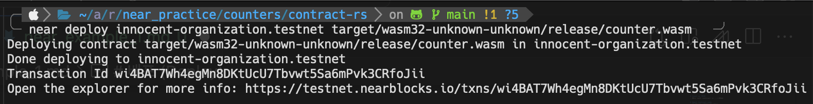

+++
title = "NEAR smart contract example 1"
date = "2024-02-26"
+++

<center>

</center>

# Count on NEAR
- 수를 세는 contract 를 만듭니다.

# Smart Contract code
- SC 코드는 아래와 같습니다.
- 참고로 `src/lib.rs` 에 작성된 파일입니다.

```rs
use near_sdk::borsh::{self, BorshDeserialize, BorshSerialize};
use near_sdk::{log, near_bindgen};


#[near_bindgen]
#[derive(Default, BorshDeserialize, BorshSerialize)]
pub struct Counter {
    val: i8,
}

#[near_bindgen]
impl Counter {
    // Public read-only method: Returns the counter value.
    pub fn get_num(&self) -> i8 {
        return self.val;
    }

    // Public method: Increment the counter.
    pub fn increment(&mut self) {
        self.val += 1;
        log!("Increased number to {}", self.val);
    }

    // Public method: Decrement the counter.
    pub fn decrement(&mut self) {
        self.val -= 1;
        log!("Decreased number to {}", self.val);
    }

    // Public method - Reset to zero.
    pub fn reset(&mut self) {
        self.val = 0;
        log!("Reset counter to zero");
    }
}
```

## 빌드
- 배포에 앞서 우선 빌드(Build)를 진행합니다.

```bash
#!/bin/sh

echo ">> Building contract"

rustup target add wasm32-unknown-unknown
cargo build --all --target wasm32-unknown-unknown --release
```

## Account 생성

- 배포하려면 또한 `NEAR Account`가 필요합니다.
- 아래의 `cargo-near` 명령어를 활용해 아무 testnet 계정을 일단 만들어봅니다.

```bash
cargo-near near create-dev-account use-random-account-id autogenerate-new-keypair save-to-legacy-keychain network-config testnet create
```

<center>

</center>

## 배포 (Deploy)

- `innocent-organization.testnet` 계정으로 배포를 시도합니다.

```bash
# near deploy <account-id> <wasm file path>
near deploy innocent-organization.testnet target/wasm32-unknown-unknown/release/counter.wasm
```

<center>

</center>


## 테스트

- 성공적으로 배포된 것을 확인하기 위해 아래와 같이 테스트를 진행합니다.

```bash
near view innocent-organization.testnet get_num
# 0

near call innocent-organization.testnet increment --useAccount innocent-organization.testnet
near view innocent-organization.testnet get_num 
# 1

near call innocent-organization.testnet decrement --useAccount innocent-organization.testnet
near view innocent-organization.testnet get_num
# 0
```