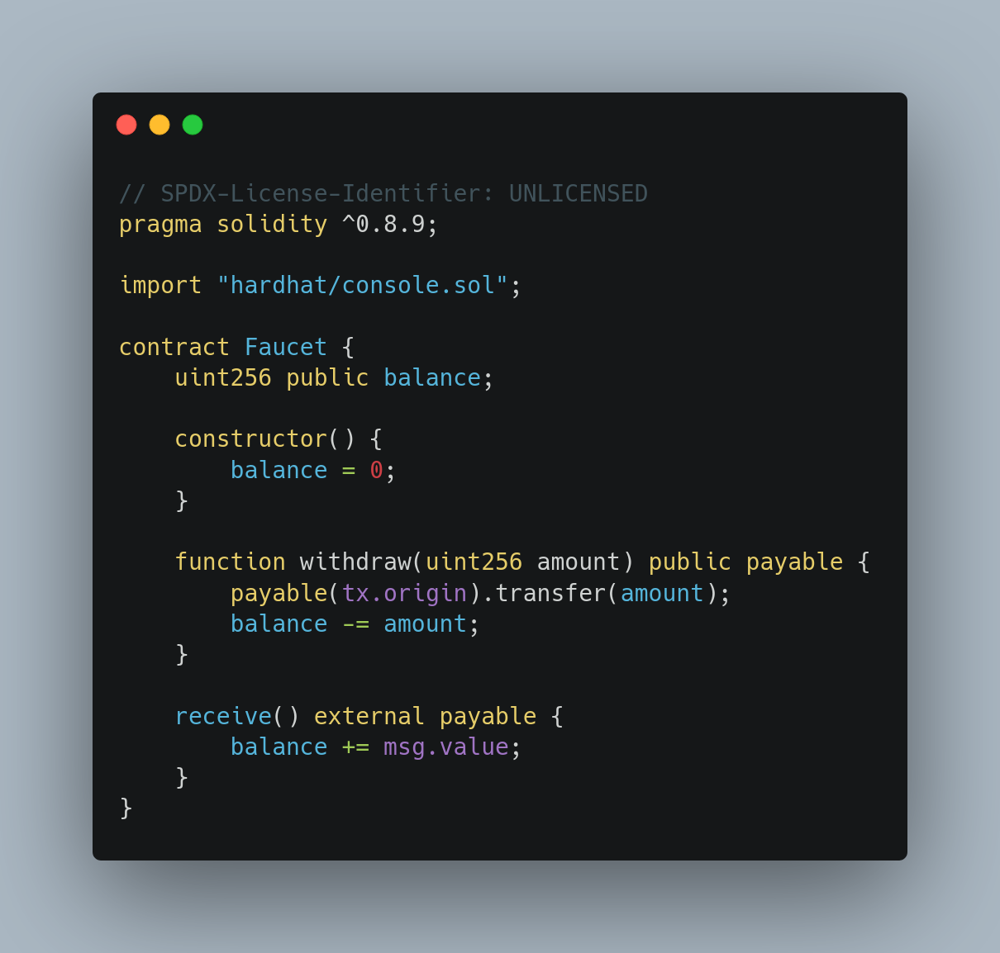
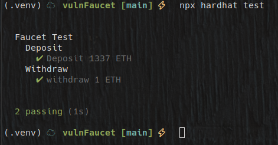
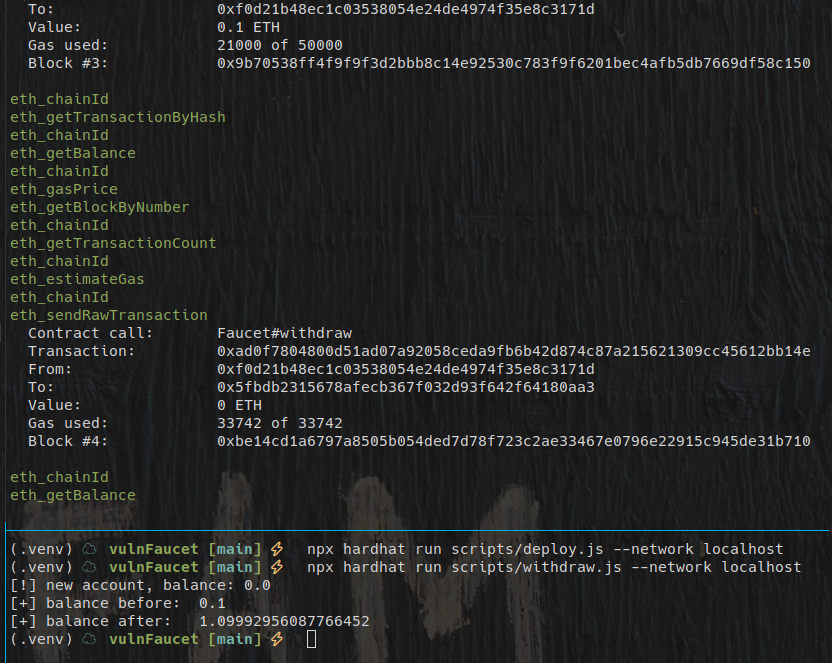
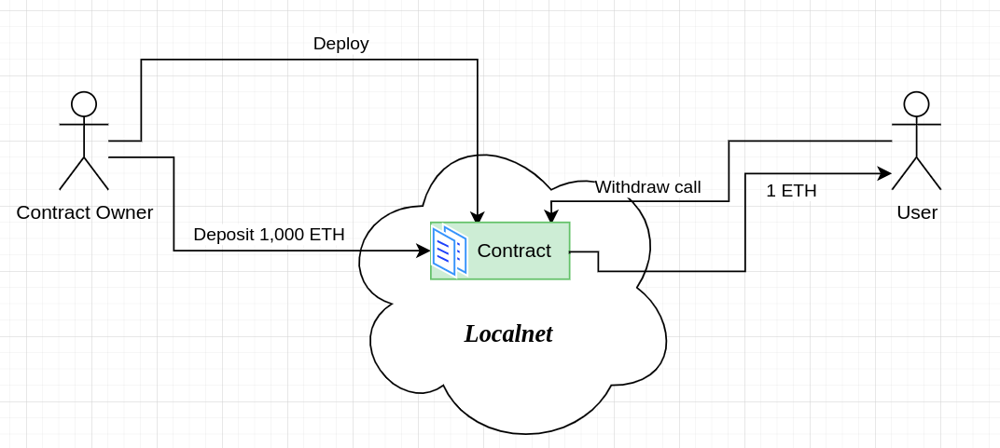

+++
title = "vuln Faucet"
date = "2023-08-24"
+++

# TL;DR
마스터링 이더리움 2장에서 언급된 `faucet` 컨트랙트를 구현하고, `hardhat` 로컬 네트워크를 이용해 *deploy*, *call* 등을 실험해봅니다.

---

# Description
`faucet`은 [Testnet](https://www.alchemy.com/overviews/what-are-testnets) 에서 테스트를 위해 필요한 암호화폐를 제공하는 서비스 입니다.
다시 말해, [Mainnet](https://academy.binance.com/en/glossary/mainnet)에서는 `실제 돈`으로 충당하던 `EVM` 사용료를 무료로 확보할 수 있는 것입니다.
이번 포스트에서 구현한 `faucet`은 `hardhat`을 이용한 *local network* 에서 동작합니다.
또, 보안을 전혀 신경쓰지 않고 있기 때문에 `vuln faucet`이라는 이름을 붙였습니다.

## Contract
실험을 위해 작성한 vulnerable faucet 코드는 아래와 같습니다.

`balance` 라는 state variable 로 현재 `Faucet`이 갖고 있는 값을 저장합니다.
`constructor`에 의해 처음 배포되면 `balance`는 `0`입니다.
누군가 `withdraw()`함수를 호출하면 요청한 값(`amount`)만큼을 보내주고, `balance`에서 값만큼 차감합니다.
누군가 *ETH* 를 컨트랙트로 전송하면 `receive()` 함수가 호출되고, `balance`에 값을 더합니다.

## Test
위 컨트랙트에 대한 총 두 가지의 *test* 를 진행했습니다.
- `1337 ETH` 를 `faucet`에 입금하고 확인합니다.
- `1 ETH`를 `withdraw()` 합니다.

실행 결과는 아래와 같습니다.

---

# Run
이제 작성한 컨트랙트를 `hardhat local network`에 배포하고 사용하는 과정을 살펴보겠습니다.
실험과정을 정리하면 아래와 같습니다.
> 배포 -> `owner`가 충분한 금액을 입금 -> 다른 `account` 로 `withdraw()` 시도 -> 금액 확인

우선 로컬 네트워크를 아래와 같이 띄워둡니다.

## Deploy
아래의 `scripts/deploy.js` 코드로 로컬 네트워크에 `Faucet` 컨트랙트를 배포합니다.

컨트랙트의 주소가 `0x5fbdb2315678afecb367f032d93f642f64180aa3` 임을 확인할 수 있습니다.

### Deposit
이제 `owner`계정으로부터 `Faucet` 컨트랙트로 돈을 송금하여 예치(deposit)해두기 위해, 아래의 `scripts/deposit.js`를 이용합니다.

## Withdraw
`withdraw()`함수를 호출하기 위해 아래의 `scripts/withdraw.js`를 이용합니다.

`withdraw()`함수를 호출하기 전, 현재 잔액이 `0`인 지갑을 하나 생성해둡니다.
그리고, 함수 호출에 사용될 가스비를 `owner`로부터 받아옵니다.
`withdraw()` 호출 전후의 잔액을 확인해봅니다.

# Conclusion

컨트랙트 배포와 배포된 컨트랙트 상의 함수를 호출하는 것을 확인할 수 있었습니다.
한가지 아쉬운 점은, Ropsten, Rinkeby, Goeril 등의 `testnet`을 이용했다면 `etherscan`을 통해 조금 더 가시적으로 트랜잭션을 확인하고 블록 생성을 확인할 수 있다는 점입니다.
향후에도 로컬넷에서 실험하는 경우가 많을 수 있으므로, `hardhat localnetwork`의 상태를 GUI 로 확인할 수 있는 방법이 있는지 연구해봐야겠습니다.

전체적인 Overview 를 정리해서 그려보면 아래와 같습니다.

